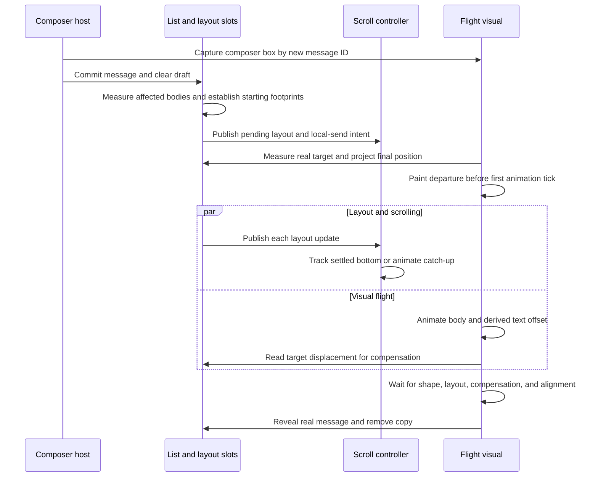

# Chat motion architecture

This index describes the current implementation and its design boundaries. Each linked note covers one
mechanism, its rationale, and code/history/validation references. Commit links establish implementation
history; they are not transcripts of every design discussion or claims that all behavior originated in one commit.

## Ownership

| Concern                                                             | Owner                                         |
| ------------------------------------------------------------------- | --------------------------------------------- |
| Conversation order, item identity, grouping, and target gaps        | List model and committed React items          |
| Current item footprint and pending layout height                    | Insertion manager and typing lifecycle        |
| Current scroll position, following intent, and reading compensation | Scroll controller                             |
| Visible entrance and composer-to-bubble movement                    | Transient visuals and flight hook             |
| Draft, composer clearance, departure capture, and reply scheduling  | Host composition; demonstrated by the stories |

The logical conversation updates immediately. Temporary layout and visual animation then represent that
state continuously. These are separate responsibilities: a tail can change immediately while its row's
spacing still animates, and a flight can finish its shape while waiting for the real row to arrive.

`ChatScrollContainer` supplies the list and scrolling. `MessageInput` and `useChatSendFlight` are separate;
the story explicitly composes them. A 35px single-line composer and 33px message/typing boxes are intentional.
Their geometry is measured independently; equal height is not an integration requirement.

## Sending sequence



User interruption can stop following and reveal the real message during this sequence. Reduced motion
bypasses the animated flight. The diagram shows ownership and dependencies, not a required ordering
between independent animation ticks.

## Design notes

| Topic                                                                                   | Scope                                                              |
| --------------------------------------------------------------------------------------- | ------------------------------------------------------------------ |
| [Bubble geometry contracts](./docs/bubble-geometry.md)                                  | Body, text, tail, and independent composer dimensions.             |
| [Composer measurement and bottom clearance](./docs/composer-measurement.md)             | Autosizing, initial positioning, and source capture timing.        |
| [Visual layers and clipping boundaries](./docs/visual-layers.md)                        | Real rows, entrance copies, flight, glass, and scroll extent.      |
| [Composer-to-bubble FLIP](./docs/composer-flip.md)                                      | Measured departure and destination, manual inverse transforms.     |
| [Inverse scale compensation](./docs/inverse-scale.md)                                   | Natural text dimensions inside a scaled carrier.                   |
| [Shared spring and offset decay](./docs/offset-decay.md)                                | Departure inset and cohesive arrival without a second text spring. |
| [Final layout projection](./docs/final-layout-projection.md)                            | One expanded destination shared by scrolling and flights.          |
| [Destination compensation during consecutive sends](./docs/destination-compensation.md) | Retarget placement without restarting the original shape clock.    |
| [Flight-to-message handoff](./docs/flight-handoff.md)                                   | Arrival predicates, interruption, and copy cleanup.                |
| [Timeline items and gap ownership](./docs/items-and-gaps.md)                            | Heterogeneous items, leading space, and immediate grouping.        |
| [Layout dependencies and local invalidation](./docs/local-invalidation.md)              | Affected rows, intrinsic observation, and long-history limits.     |
| [Atomic layout transactions](./docs/layout-transactions.md)                             | Read/write ordering that prevents temporary scroll clamps.         |
| [Animated layout slots](./docs/layout-slots.md)                                         | Top-aligned full-size bodies and temporary animated footprints.    |
| [Default visual entrance](./docs/default-presence.md)                                   | Shared upward fade and explicit special cases.                     |
| [Bottom following as user intent](./docs/bottom-following.md)                           | Following, catch-up, detachment, and user escape.                  |
| [Scroll ownership and browser clamping](./docs/scroll-ownership.md)                     | One observation cursor for layout and native scroll events.        |
| [Preserving the reading anchor](./docs/reading-anchor.md)                               | Detached insertion compensation and fractional rounding.           |
| [Reversible typing presence](./docs/typing-presence.md)                                 | Entry, exit, and reversal with independent visual lifetime.        |
| [Typing-to-message replacement](./docs/typing-replacement.md)                           | Footprint and velocity transfer with a simultaneous crossfade.     |
| [Spring parameters and playback scaling](./docs/spring-parameters.md)                   | Frequency, damping, velocity units, and motion preferences.        |

## Integration

Use stable, unique IDs across every item type. Update items immutably. `items` takes precedence over
`messages`, which remains a message-only shorthand.

```tsx
<ChatScrollContainer
  items={[
    { id: 'hello', variant: 'incoming', content: 'Hello.' },
    { id: 'date', kind: 'date', dateTime: '2026-09-15', label: 'Tuesday, September 15' },
    { id: 'reply', variant: 'outgoing', content: 'Good morning.' },
    { id: 'status', kind: 'status', content: 'Looking up the cafe…' },
  ]}
/>
```

Ordinary insertion uses layout expansion and an upward fade. Composer flight and typing replacement
are explicit special paths. There is no general arbitrary-item removal animation or virtualized list.
The current outgoing-insertion policy requests bottom scrolling even for outgoing history insertion.

## Text placement during flight

See [Shared spring and offset decay](./docs/offset-decay.md) and
[Inverse scale compensation](./docs/inverse-scale.md). These notes explain the shared progress,
coordinate conversion, and arrival continuity used by the flight implementation.

## Demonstration and verification

- [Automatic reply demonstration](./docs/demo-conversation.md): preset inputs, deterministic fallback,
  labels, reply timing, and the shared guided story.
- [Verification guide](./docs/verification.md): regression entry points and manual scenarios.
- [Story composition](./chat-scroll-container.stories.tsx): explicit composer, receive, typing, and flight wiring.
